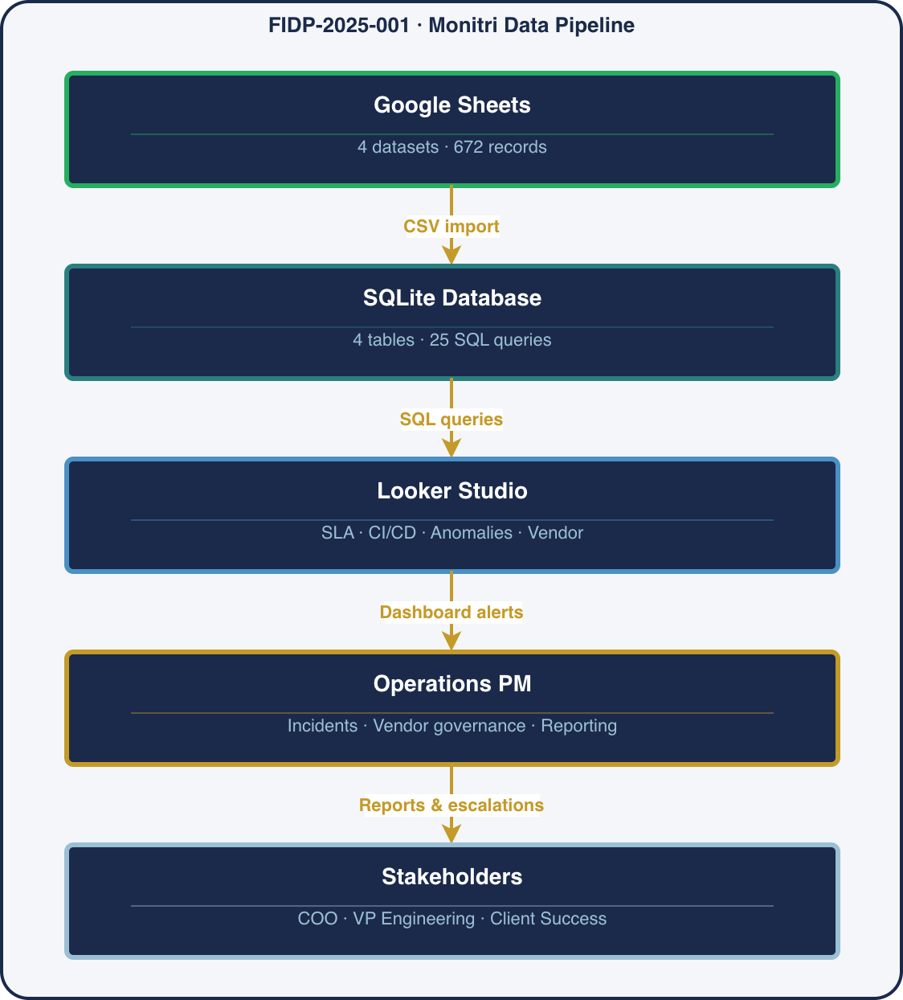
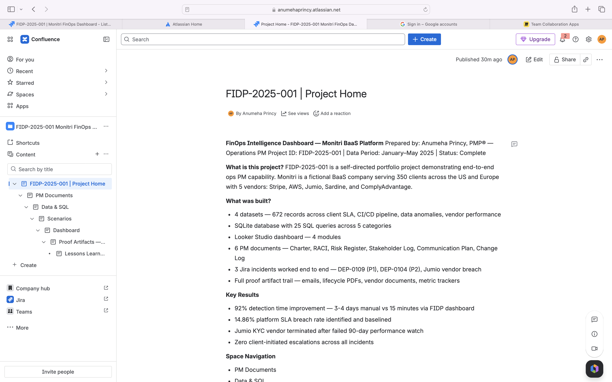

# FIDP-2025-001 | FinOps Intelligence Dashboard

> Operations PM Portfolio Project — Monitri BaaS Platform
Monitri is a simulated Banking-as-a-Service (BaaS) platform created to demonstrate enterprise Operations PM workflows in a realistic business environment.

I built this project to answer one question: what does structured Operations PM work actually look like, end to end?

Not a template. Not a course assignment. A full operational intelligence system — built from scratch, documented at every step, and designed to hold up in an interview.

**Anumeha Princy, PMP® — Operations Project Manager — Sunnyvale, CA**

---

## What's inside

| | |
|---|---|
| 350 simulated enterprise clients | 25 SQL queries |
| 5 strategic vendors | 4 Looker Studio dashboard modules |
| 672 operational records | 3 scenarios worked end to end |
| 6 PM governance documents | Jira · Confluence · GitHub · SQLite |

---

## Explore the project

- [Executive Dashboard — Looker Studio](https://datastudio.google.com/reporting/1bb9107c-bb54-44c7-869b-641a73f20fa2)
- [Case Study PDF](./case-study/Monitri_Case_Study_Version_Final.pdf)
- [Executive Brief](./docs/Executive%20Brief)
- [Confluence Space](https://anumehaprincy.atlassian.net)
- [Jira Board — F20MFD](https://anumehaprincy.atlassian.net)
- [SQL Queries](./queries)
- [System Architecture](./Monitri_Data_Pipeline1.drawio.png)
- [Screenshots & Artifacts](./screenshots)

---

## Dashboard

🔗 **[View Live Looker Studio Dashboard](https://datastudio.google.com/reporting/1bb9107c-bb54-44c7-869b-641a73f20fa2)**

*SLA/SLO Performance Tracker — 52 of 350 clients breached SLA across Jan–May 2025*

*Vendor Scorecard — Jumio identified as most persistent underperformer (4 consecutive breaches)*

*CI/CD Health Monitor — 16 failed deployments, 1,769 minutes total downtime*

*Data Anomaly Alerts — 7 High/Critical anomalies escalated to VP Engineering*

---

## System Architecture

---

## Jira Board

---

## Confluence Space

---

## What this project covers

Operations PM work isn't just tracking tasks. This project covers the parts that actually matter in a real ops environment:

- Structured delivery — Charter, RACI, Risk Register, Comms Plan, Change Log, closeout
- Incident management — two live scenarios, P1 and P2, worked through triage, resolution, and RCA
- Vendor governance — from performance monitoring to a COO-approved termination
- SQL analytics — 25 queries across four tables, built to answer real operational questions
- Executive reporting — dashboards, briefings, and escalations that support actual decisions
- Stakeholder communication — written for the COO, VP Engineering, and Client Success

---

## What came out of it

- Detection time dropped from days of manual review to a 15-minute monitoring cadence
- Fragmented operational data pulled into one executive reporting platform
- Three scenarios documented end to end — nothing summarized, nothing skipped
- Every vendor decision traceable from the first warning sign to offboarding
- A documentation trail where every decision has a reason, a record, and a next step

---

> This project demonstrates how an Operations Project Manager transforms operational data into executive decisions — through structured governance, analytics, and stakeholder communication.
